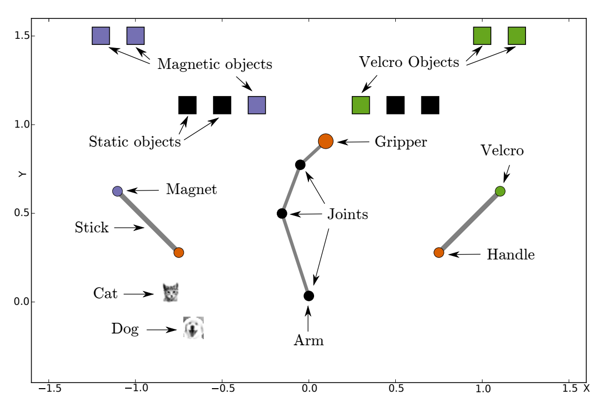

# IMGEP MAP Elites
This repo implements two evolutionary algorithms: *Intrinsically Motivated Goal Exploration Process* (https://arxiv.org/abs/1708.02190) combined with *MAP-Elites* (https://arxiv.org/abs/1504.04909).
The two algorithms are applied to a 2D robot manipulation task, where a robot arm is tasked with moving some sferes to given locations and they must grasp and use a stick to do so, whilst doing it in novel ways. The environment is shown below:

The aim is for this project to show the advantages of using the curiosity score to bias selection in MAP-Elites over utilizing uniform selection.

## Running
### IMGEP
To run IMGEP move to the `/scripts` directory and run `run_IMGEP.sh`.
### MAP-Elites
To run MAP-Elites move to the `/scripts` directory and run `runner.sh`.

An example of the results with various evolutionary parameters is shown below:


### Typical configuration:
```
px = \
    {
        # more of this -> higher-quality CVT
        "cvt_samples": 25000,
        # we evaluate in batches to parallelize
        "batch_size": 100,
        # proportion of niches to be filled before starting
        "random_init": 0.01,
        # batch for random initialization
        "random_init_batch": 100,
        # when to write results (one generation = one batch)
        "dump_period": 1e4,
        # do we use several cores?
        "parallel": True,
        # do we cache the result of CVT and reuse?
        "cvt_use_cache": True,
        # min/max of parameters
        "min": 0,
        "max": 1,
        # probability of mutating each number in the genotype
        "mutation_prob": 0.2
    }

num evals = 1e7
niches = 15:100:100

polynomial mutation 0.2 prob 
```
